# Venue Schema + Impact Map

**Generated from `wedsy-server` main @ `b8eda9c`** (MB-V2 merged). Read-only documentation — no code changed.
Companion repos referenced: `wedsy-venue` (owner partner dashboard), `wedsy-user` (couple site), `wedsy-os` (internal OS venues module).

> Scope note: the venue engine owns its own `Venue*` collections. The CRM/Sales engine (`models/Enquiry.js`, etc.) is a **separate model space** — the only bridges are (a) the read-only `GET /admin/enquiries/:enquiryId/venue-journey` panel, which reads CRM `Enquiry` then joins to `VenueEnquiry`/`VenueConversation`/`VenueMessage`, and (b) the new venue-owned `VenueForwardRequest` write-bridge (`status:"pending_os"`, consumed by OS). No venue write path ever touches a CRM collection.

---

## PART A — Entity Inventory

Every field, enum values, indexes (⚠ = unique/atomic guard), and `ref:` relationships. Collection name = lowercased Mongoose model name (e.g. `VenueSpaceDate` → `venuespacedates`).

### Venue  — `venues`
Core listing/profile. Fields:
- `name` String (req, trim), **`slug` String (req, ⚠ unique)**, `tagline` String, `description` String
- `venueType` String enum **[resort, farmhouse, villa, hotel, heritage, banquet_hall, club, other]** default resort
- `established` Number, `city` String default "Bangalore", `address` String, `location` {type, coordinates[Number]} (2dsphere), `locationDescription`, `zone` String enum **[north, south, east, west, central, airport, ""]** default "", `locality`, `googlePhotos[String]`, `enrichedAt` Date, `areas[String]`, `state`, `pincode`, `formattedAddress`
- `spaces[]` subdoc: {name, `type` enum [indoor, outdoor, semi-outdoor], capacitySeated, capacityStanding, bestFor[], description, photos[], `isBookable` Bool default true} — **subdoc `_id` is referenced by VenueHold.space, VenueSpaceDate.space, VenueRoomAllotment.room (via rooms[]), VenueRoomNight.room**
- `accommodation` {available, totalCapacity, roomTypes[{name,count,occupancyPerRoom,maxPeoplePerRoom,pricePerNight,isAC,description,photos[]}]} (marketing)
- `rooms[]` subdoc (PMS operational): {name (req), `type` enum [standard, deluxe, suite, dorm, other] default standard, capacity, notes, `isActive`} — **subdoc `_id` referenced by VenueRoomAllotment.room + VenueRoomNight.room**
- `pricing` {currency default INR, minimumDuration, tiers[{hours,price}], perPlate{veg,nonVeg}, securityDeposit, advancePercent default 30, peakSeasonMarkup, note}
- `cateringPolicy` {type enum [in_house_only, outside_allowed, both, unknown], outsideKitchenFee, outsideSetupFrom, dietaryOptions[], cuisines[], minPerPlate}
- `decorPolicy` {outsideAllowed, inHouseAvailable, setupAccessFrom, restrictions}
- `musicPolicy` {liveMusicAllowed, djAllowed, outdoorCurfew, indoorCurfew, inHouseSoundSystem}
- `amenities` {~26 booleans (swimmingPool, generatorBackup, parking, parkingCapacity Number, helipad, garden, airConditioning, cctv, wifi, elevator, bridalSuite, kalyanMandap, floatingMandap, groomRoom, makeupRoom, changingRooms, prayerRoom, fireNOC, liquorLicense, dayOfCoordinator, securityStaff, housekeeping, valetParking, shuttleService, petFriendly, smokingAllowed, evCharging), `outsideAlcohol` enum [yes, no, extra_charge] default no}
- `photos` {venue[], decor[], rooms[], spaces[]}, `coverPhoto`, `featurePhoto`, `logo` (PDF branding)
- `policies` {cancellation, refund, otherRestrictions} (legacy) → migrated on read into `policyDoc` {policies[], terms[], refund[]}
- `contact` {primaryName, primaryPhone, secondaryPhone, email, website, bestTimeToReach default anytime, languages[], whatsappPhone, whatsappSameAsPrimary, phones[{number,name}]}
- `blockedDates[String]` (legacy venue-wide blocks)
- `settings` {`holdExpiryDays` Number default 5 (min 1, max 60), `documentsWhiteLabelDefault` Bool default false}
- backward-compat: `phone`, `email`, `website`, `googlePlaceId`, `googleRating`, `googleReviewCount`, `scrapedFrom[]`, `seoKeywords[]`
- **`dataCompleteness` Number default 1**, `featured` Bool
- **`status` String enum [draft, published, pending_outreach, outreach_sent, verified, rejected] default draft**
- `vendorId` → **Vendor** (legacy claim marker), `gstin`, `pan`, `invoicePrefix`
- `enquiries[]` → **VenueEnquiry** (denormalized id list)
- `nearbyAccommodation[]`, `nearbyAccommodationRefreshedAt`, `googleReviews[]`, `googleReviewsRefreshedAt`, `competitiveCache` {computedAt, payload Mixed}
- **Indexes:** `location` 2dsphere (sparse), `slug`, `status`, `{city, venueType}`
- **Refs out:** `vendorId`→Vendor, `enquiries[]`→VenueEnquiry

### VenueOwner  — `venueowners`
The account anchor (claim/OTP lifecycle). Fields: `name` (req), `phone` (req), `email`, **`role` String enum VENUE_ROLES [owner, manager, sales, listing_manager, marketing] default owner**, `venueId`→**Venue** (req), `verificationStatus` enum **[pending, phone_verified, verified]** default pending, `claimedAt`, `lastLoginAt`, `isActive` Bool default true.
- **Indexes:** `phone`, `venueId`

### VenueEnquiry  — `venueenquiries`
The venue lead. Fields: `venueId`→**Venue** (req), `userId`→**User**, `name`, `phone`, `coupleName`, `couplePhone`, `email`, `eventDate` Date, `guestCount` Number, `budget` String, `vibe[String]`, `message`
- **`source` enum [wedsy, instagram, referral, walk_in, justdial, wedmegood, google, other] default wedsy**
- **`stage` enum [new, contacted, site_visit_scheduled, site_visit_done, proposal_sent, negotiating, booked, lost] default new** (8-enum)
- `estimatedValue` Number, `lostReason` enum ["", too_expensive, date_unavailable, chose_competitor, no_response, other], `followUpDate`, **`assignedTo` String** (VenueTeamMember name/id as string, NOT a ref)
- **`crmLeadRef` String** (MB-V2 D2 — CRM lead id back-link, plain string)
- `notes[{text, addedAt}]`, `activities[{type, description, timestamp}]`
- **`status` enum [new, contacted, site_visit_scheduled, negotiating, booked, lost] default new** (6-enum, separate from stage), `outreachSentAt`, `outreachChannel`, `followUp24hSentAt`, `followUp48hSentAt`
- **Indexes:** `venueId`, `userId`, `{venueId, stage}`, `{venueId, source}`
- **Refs out:** `venueId`→Venue, `userId`→User

### VenueBooking  — `venuebookings`
Fields: `venue`→**Venue** (req), `enquiry`→**VenueEnquiry**, `coupleName`, `couplePhone`, `days[{date, eventType, guestCount, spaces[String]}]`, `totalValue`, `paymentSchedule[{label,dueDate,amount}]`, `specialRequirements`, `status` enum **[confirmed, in_progress, completed, cancelled]** default confirmed, `createdBy`→**VenueOwner**, `roomsHistory[{allotment→VenueRoomAllotment, roomName, guestName, checkInAt, checkOutAt, guestCount, extraBeds, damagesTotal, deducted, refundDue, archivedAt}]`
- **Indexes:** `{venue, createdAt}`, **`enquiry` ⚠ unique sparse** (one booking per enquiry)

### VenueQuote  — `venuequotes`
Fields: `venue`→Venue (req), `enquiry`→VenueEnquiry (req), `version` Number, `lineItems[{label, category enum [venue_hire, catering, decoration, accommodation, other], qty, unitPrice, perDay, day}]`, `gstPercent`, `gstMode` enum [exclusive, inclusive, none], `whiteLabel` Bool, `discount`, `totals{subtotal,taxable,gst,grandTotal}`, `terms[]`, `acceptance{name,phone,at,channel enum [link,whatsapp,""]}`, `status` enum **[draft, sent, accepted, superseded]** default draft
- **Indexes:** `{venue, createdAt}`, `{enquiry, version:-1}`

### VenueBill  — `venuebills`  (D8 bill-before-invoice)
Fields: `venue`→Venue (req), `booking`→**VenueBooking** (req), `billNumber` String, `isAddon` Bool, `lineItems[{label,category,qty,unitPrice,perDay,day}]`, `gstMode` enum GST_MODES, `whiteLabel`, `gstPercent`, `discount`, `totals{}`, `terms[]`, `status` enum **[draft, sent, accepted, converted, void]** default draft, `invoiceRef`→**VenueInvoice**, `acceptance{name,phone,at,channel}`, `notes`
- **Indexes:** `{venue, createdAt}`, `booking`

### VenueInvoice  — `venueinvoices`  (GST invoice; numbering via VenueCounter)
Fields: `venue`→Venue (req), `booking`→VenueBooking (req), **`invoiceNumber` String (req)**, `seq` Number (req), `kind` enum [advance, final, addon], `lineItems[]`, `gstPercent`, `gstMode` enum [exclusive, inclusive, none], `whiteLabel`, `discount`, `totals{}`, `terms[]`, `acceptance{}`, `billRef`→VenueBill, `status` enum **[unpaid, partially_paid, paid]** default unpaid
- `payments[]` subdoc (D7 approval): {date, amount, `mode` enum [bank_transfer, cash, cheque, upi, card], note, `recordedByType` enum [owner, member, ""], recordedById, recordedByName, collectedBy, proofUrl, **`status` enum [pending_approval, approved, rejected] default approved**, ownerEntry Bool, approvedByName, approvedAt, rejectedReason}
- **Indexes:** `{venue, createdAt}`, `booking`, **`{venue, invoiceNumber}` ⚠ unique**

### VenueContract  — `venuecontracts`
Fields: `venue`→Venue (req), `booking`→VenueBooking (req), `version`, `sections[{heading, clauses[]}]`, `parties{venueName, coupleName, couplePhone}`, `specifics{days[], totalValue, paymentSchedule[]}`, `status` enum **[draft, sent, acknowledged, void]** default draft, `sentAt`, `acknowledgedAt`, `acknowledgmentName`, `acknowledgmentPhone`
- **Indexes:** `{venue, booking, version:-1}`

### VenueDocumentTemplate  — `venuedocumenttemplates`
Fields: `venue`→Venue (req), `type` enum **[quote, bill, invoice, contract, custom]** (req), `name` (req), `lineItems[]`, `sections[]`, `terms[]`, `gstMode` enum GST_MODES, `gstPercent`
- **Indexes:** **`{venue, type, name}` ⚠ unique**

### VenueConversation  — `venueconversations`
Fields: `venueId`→Venue (req), `enquiryId`→VenueEnquiry (req), `userId`→**User** (req), `status` enum **[open, closed, archived]** default open, `lastMessageAt`, `unreadCountVenue`, `unreadCountCouple`, **`flagged` Bool** (D4 triage), **`flaggedTerms[String]`**, **`lastCoupleMessageAt` Date** (D4 SLA)
- **Indexes:** `venueId`, `userId`, **`enquiryId` ⚠ unique** (one thread per enquiry)

### VenueMessage  — `venuemessages`
Fields: `conversationId`→VenueConversation (req), `senderId` ObjectId (req), **`senderType` enum [couple, venue, wedsy]** (req), **`messageType` enum [text, package, quote, gallery, offer]** default text, `content{text}`, **`target` enum [both, couple_only, venue_only] default both** (D4), **`offer{title, body, validUntil}`** (D4), **`flaggedTerms[String]`** (D4), `isRead` Bool
- **Indexes:** `conversationId`

### VenueTeamMember  — `venueteammembers`
Fields: `venueId`→Venue (req), `ownerId`→**VenueOwner** (anchor), `name` (req), `phone` (req), `email` (lowercase), **`role` enum VENUE_ROLES [owner, manager, sales, listing_manager, marketing] default sales** (legacy fallback), **`roleRef`→VenueRole** (RBAC v2), `passwordHash` (select:false), `isActive` Bool, `invitedBy` ObjectId, `lastLoginAt`
- **Indexes:** **`{venueId, phone}` ⚠ unique**, `phone`, **`{venueId, email}` ⚠ unique partial (email>"")**, `email`

### VenueRole  — `venueroles`  (RBAC v2 capability bundle)
Fields: `venue`→Venue (req), `name` (req), **`capabilities[String enum CAPABILITIES_V2]`** [leads, bookings_money, documents, rooms_checkin, listing, availability, team, insights, chats], `isDefault` Bool, `isSystem` Bool (immutable Owner)
- **Indexes:** **`{venue, name}` ⚠ unique**

### VenueRoomAllotment  — `venueroomallotments`  (PMS)
Fields: `venue`→Venue (req), `booking`→VenueBooking (req), **`room` ObjectId (req; Venue.rooms subdoc _id)**, `guestName`, `guestPhone`, `checkInAt` (req), `checkOutAt` (req), `actualCheckInAt`, `actualCheckOutAt`, `status` enum **[allotted, checked_in, checked_out, cancelled]** default allotted, `notes`, `createdBy`→VenueOwner, `checkIn{guestCount, extraBeds, inventory[], idCaptureUrl, photoUrl, signatureUrl, notes, byName, at}` (D6), `deposit{amount}`, `checkOut{checklist[], damages[], notes, byName, at}`, `settlement{deposit, damagesTotal, deducted, refundDue, payableDue, invoiceRef→VenueInvoice, settledAt}`, `archived` Bool, `archivedAt`
- **Indexes:** `{venue, booking}`, `{venue, room, checkInAt}`

### VenueRoomNight  — `venueroomnights`  (PMS atomic guard)
Fields: `venue`→Venue (req), **`room` ObjectId (req)**, `night` Date (req, midnight UTC), `allotment`→VenueRoomAllotment (req)
- **Indexes:** ⚠ **`{room, night}` UNIQUE — the atomic double-booking guard** (concurrent allotments race on insertMany here; exactly one wins on E11000, no transactions), `allotment`

### VenueSpaceDate  — `venuespacedates`  (D3 date-inventory atomic guard)
Fields: `venue`→Venue (req), **`space` ObjectId (req; Venue.spaces subdoc _id)**, `date` Date (req, midnight UTC), `state` enum **[held, booked, blocked]** (req), `holdRef`→VenueHold, `bookingRef`→VenueBooking, `batchRef` ObjectId (manual-block group), `notes`
- **Indexes:** ⚠ **`{venue, space, date}` UNIQUE — the atomic double-claim guard** (absence of row = open; writers insertMany ordered:true, treat E11000 as "held by someone else"), `{venue, date}`, `holdRef`

### VenueHold  — `venueholds`  (D3)
Fields: `venue`→Venue (req), `space` ObjectId (Venue.spaces subdoc _id; absent=venue-wide), `dates[Date]` (req), **`requestedBy` enum [wedsy, owner]** (req), `requestedByName`, `linkedEnquiry`→VenueEnquiry, `status` enum **[requested, approved, declined, expired, converted, released]** default requested, `expiresAt` (req), `notes`, `decidedAt`, `decidedBy`
- **Indexes:** `{venue, status}`, `{status, expiresAt}` (expiry sweep), `linkedEnquiry`

### VenueActivity  — `venueactivities`  (D10 append-only spine)
Fields: `venue`→Venue (req), **`actorType` enum [venue_team, wedsy_team, system]** (req), `actorId` ObjectId, `actorName`, `action` (req), `entity` default venue, `field` (dotted path), `old`/`new` (JSON-stringified snapshots), **`severity` enum [high, normal, low] default normal**, `at` Date
- **Indexes:** `{venue, at:-1}`, `{venue, severity, at:-1}`
- **APPEND-ONLY:** pre-hooks on updateOne/updateMany/findOneAndUpdate/deleteOne/deleteMany/findOneAndDelete/replaceOne + non-new save all throw. No update/delete path exists.

### VenueShortlist  — `venueshortlists`  (MB-V2 P1, venue-owned planner storage)
Fields: **`crmEnquiryId` String (req, ⚠ unique)** (CRM lead id, plain string), `coupleName`, `couplePhone`, `items[]` subdoc {`venue`→Venue (req), `status` enum [shortlisted, presented, reacted], `reaction` enum ["", love, maybe, no], `notes`, `holdRef`→VenueHold, `visitRef`→VenueSiteVisit}, **`presentToken` String (⚠ unique sparse)** (public present-mode credential), `createdBy`→**Admin**, `createdByName`
- **Indexes:** `presentToken` unique sparse, **`crmEnquiryId` ⚠ unique**

### VenueSiteVisit  — `venuesitevisits`  (MB-V2 P1)
Fields: `venue`→Venue (req), `enquiryRef`→VenueEnquiry (req), `scheduledAt` (req), `status` enum **[scheduled, confirmed, completed, cancelled]** default scheduled, `notes`, `createdByType` enum [wedsy, owner] default wedsy
- **Indexes:** `{venue, scheduledAt}`, `{status, scheduledAt}`

### VenueForwardRequest  — `venueforwardrequests`  (MB-V2 P0 S4 — D1 CRM bridge)
Fields: `venue`→Venue (req), **`enquiryRef`→VenueEnquiry (req, ⚠ unique — idempotent bridge)**, `coupleName`, `couplePhone` (denormalized snapshots), `notes` (maxlen 2000), `forwardedBy`→**Admin**, `forwardedByName`, `status` enum **[pending_os, accepted, rejected] default pending_os**
- **Indexes:** `{status, createdAt}`, `{venue, createdAt}`

### VenueOnboardingRequest  — `venueonboardingrequests`
Fields: `name` (req), `venueName` (req), `city`, `phone` (req), `status` enum **[new, contacted, converted, dropped] default new**
- **Indexes:** `{status, createdAt}`, `phone`

### VenueClaimRequest  — `venueclaimrequests`
Fields: `venueId`→Venue, `venueName`, `venueSlug`, `newVenueName`, `newVenueType`, `newVenueAddress`, `name` (req), **`designation` enum [owner, manager, marketing] default owner** ⚠ (3-enum — DRIFT vs VenueOwner.role's 5-enum), `phone` (req), `email` (req), `howHeard`, `message`, `tier` enum **[phone_mismatch, document_failed, no_phone, new_venue_signup]** default phone_mismatch, `status` enum **[pending_manual_review, approved, rejected]** default pending_manual_review, `reviewedBy`→**Admin**, `reviewedAt`, `reviewNote`
- **Indexes:** `venueId`, `status`, `phone`

### VenueView  — `venueviews`  (analytics, no PII)
Fields: `userId`→User (optional), `venueId`→Venue (req), `venueSlug`, `sessionHash` (sha256, opaque), `source` default direct, `viewedAt`
- **Indexes:** `userId`, `{venueId, viewedAt}`, `{venueId, sessionHash, viewedAt}`

### VenueNotification  — `venuenotifications`  (MB-V2 P3 mesh)
Fields: `venue`→Venue (optional — absent for onboarding/new-venue-claim), `type` enum **[hold_requested, lead_forwarded, claim_arrived, onboarding_arrived]** (req), `title`, `body`, `channel` default "log", `meta` Mixed, `readAt`
- **Indexes:** `{createdAt}`, `{type, createdAt}`

### VenueMessageTemplate  — `venuemessagetemplates`
Fields: `venue`→Venue (req), `name` (req), `body` (req), `createdBy`→VenueOwner. Index: `{venue, createdAt}`

### VenueLeadInteraction  — `venueleadinteractions`
Fields: `enquiry`→VenueEnquiry (req), `venue`→Venue (req), `type` enum **[call, whatsapp, email, site_visit, meeting, enquiry]** (req), `note`, `createdBy`→VenueOwner. Index: `{enquiry, createdAt}`

### VenueLeadImport  — `venueleadimports`
Fields: `venue`→Venue (req), `importedBy`→VenueOwner, `fileName`, `total`, `created`, `skipped`. Index: `{venue, createdAt}`

### VenueRunsheetItem  — `venuerunsheetitems`  (PMS)
Fields: `venue`→Venue (req), `booking`→VenueBooking (req), `day` Date (req), `time`, `title` (req), `owner` String, `vendorPhone`, `category` enum **[setup, ceremony, catering, vendor, teardown, other]**, `status` enum **[pending, in_progress, done]**, `order`, `notes`, `seeded` Bool. Index: `{venue, booking, day, order}`

### VenueSheetIntegration  — `venuesheetintegrations`
Fields: `venue`→Venue (req, ⚠ **unique** — one per venue), `refreshToken` (AES-256-GCM ciphertext), `spreadsheetId`, `sheetName`, `columnMap` Mixed, `lastSyncAt`, `status` enum **[disconnected, connected, error]**, `rowMap` Mixed, `stageColumn`. (No compound index; `venue` unique.)

### VenueTeamActivity  — `venueteamactivities`
Fields: `venueId`→Venue (req), `actorId` String, `actorName`, `action` (req), `targetMemberId` String, `detail`. Index: `{venueId, createdAt}`

### VenueCounter  — `venuecounters`  (atomic sequences)
Fields: `key` String (req, ⚠ **unique**; e.g. `<venueId>:invoice`), `seq` Number. Static `.next(key)` does findOneAndUpdate($inc) upsert — race-free invoice numbering. **Internal-only** (used by VenueInvoice creation).

### Cross-project models touched by venue reads (NOT venue-owned)
- **User** — `venueusers`? no: shared `users`. Referenced by VenueEnquiry.userId, VenueConversation.userId, VenueView.userId. Read (name/phone) by venue chat + journey; written only by the seed fixture (couple account for chat).
- **Admin** — shared `admins`. Referenced by VenueShortlist.createdBy, VenueForwardRequest.forwardedBy, VenueClaimRequest.reviewedBy. The venue engine **only stores an Admin `_id` snapshot**; it never reads the Admin permission model. `CheckAdminLogin` (auth path) reads Admin independently.
- **Enquiry** (CRM) — read-only, ONLY by `repositories/VenueJourneyRepository.js` for the `/admin/enquiries/:id/venue-journey` panel. No venue write path touches it.

---

## PART B — Mermaid ER Diagram

```mermaid
erDiagram
    Venue ||--o{ VenueOwner : "venueId"
    Venue ||--o{ VenueTeamMember : "venueId"
    Venue ||--o{ VenueRole : "venue"
    VenueTeamMember }o--o| VenueRole : "roleRef"
    VenueOwner ||--o{ VenueTeamMember : "ownerId"

    Venue ||--o{ VenueEnquiry : "venueId"
    User ||--o{ VenueEnquiry : "userId"
    Venue ||--o{ VenueLeadInteraction : "venue"
    VenueEnquiry ||--o{ VenueLeadInteraction : "enquiry"
    Venue ||--o{ VenueLeadImport : "venue"

    VenueEnquiry ||--o| VenueBooking : "enquiry (unique)"
    Venue ||--o{ VenueBooking : "venue"
    VenueEnquiry ||--o{ VenueQuote : "enquiry"
    Venue ||--o{ VenueQuote : "venue"
    VenueBooking ||--o{ VenueBill : "booking"
    VenueBill ||--o| VenueInvoice : "invoiceRef"
    VenueBooking ||--o{ VenueInvoice : "booking"
    VenueInvoice ||--o| VenueBill : "billRef"
    VenueBooking ||--o{ VenueContract : "booking"
    Venue ||--o{ VenueDocumentTemplate : "venue"
    VenueCounter ||..|| VenueInvoice : "seq source (internal)"

    Venue ||--o{ VenueConversation : "venueId"
    VenueEnquiry ||--o| VenueConversation : "enquiryId (unique)"
    User ||--o{ VenueConversation : "userId"
    VenueConversation ||--o{ VenueMessage : "conversationId"

    Venue ||--o{ VenueHold : "venue"
    VenueEnquiry }o--o| VenueHold : "linkedEnquiry"
    Venue ||--o{ VenueSpaceDate : "venue"
    VenueHold ||--o{ VenueSpaceDate : "holdRef"
    VenueBooking ||--o{ VenueSpaceDate : "bookingRef"

    Venue ||--o{ VenueRoomAllotment : "venue"
    VenueBooking ||--o{ VenueRoomAllotment : "booking"
    VenueRoomAllotment ||--o{ VenueRoomNight : "allotment (unique room-night)"
    Venue ||--o{ VenueRoomNight : "venue"
    Venue ||--o{ VenueRunsheetItem : "venue"
    VenueBooking ||--o{ VenueRunsheetItem : "booking"

    Venue ||--o{ VenueActivity : "venue"
    Venue ||--o{ VenueView : "venueId"
    Venue ||--o{ VenueNotification : "venue"
    Venue ||--o{ VenueMessageTemplate : "venue"
    Venue ||--o| VenueSheetIntegration : "venue (unique)"
    Venue ||--o{ VenueTeamActivity : "venueId"

    VenueShortlist ||--o{ VenueShortlistItem : "items[]"
    Venue ||--o{ VenueShortlistItem : "item.venue"
    VenueShortlistItem }o--o| VenueHold : "holdRef"
    VenueShortlistItem }o--o| VenueSiteVisit : "visitRef"
    Admin ||--o{ VenueShortlist : "createdBy"
    Venue ||--o{ VenueSiteVisit : "venue"
    VenueEnquiry ||--o{ VenueSiteVisit : "enquiryRef"

    Venue ||--o{ VenueForwardRequest : "venue"
    VenueEnquiry ||--o| VenueForwardRequest : "enquiryRef (unique)"
    Admin ||--o{ VenueForwardRequest : "forwardedBy"
    Venue ||--o{ VenueClaimRequest : "venueId"
    Admin ||--o{ VenueClaimRequest : "reviewedBy"

    Enquiry_CRM ||..o{ VenueEnquiry : "journey join by phone/userId (read-only)"
    Enquiry_CRM ||..o| VenueForwardRequest : "crmEnquiryId / pending_os (OS consumes)"
    Enquiry_CRM ||..o| VenueShortlist : "crmEnquiryId (string, OS embed)"
```

*Note: `VenueShortlistItem` is the embedded `items[]` subdoc of VenueShortlist (not a top-level collection). `Enquiry_CRM` is the separate CRM engine — dotted edges are cross-project string/journey links, never FK writes.*

---

## PART C — THE IMPACT MAP

One row per model. **Written by** / **Read by** = route entry points (controller.fn). **Frontend** shorthand: `OWN`=wedsy-venue owner dashboard, `CPL`=wedsy-user couple site, `OS`=wedsy-os venues module. Route prefixes: unmarked = `/venues/*` (owner+public), `AV`=`/admin/venues/*` (admin/OS), `VO`=`/venue-owner/*`, `CV`=`/conversations/*`. "internal" = no route (util/cron/service).

| Model | Written by (routes → controller.fn) | Read by | Frontend surfaces | OS / cross-project consumers |
|---|---|---|---|---|
| **Venue** | `POST /` createVenue; `PUT /:slug` updateVenue; cache/enrich writes (nearby, reviews, location, competitive, calendar/settings, documents/settings); `POST /:slug/availability`; `VO /claim/verify`+`/claim/document` (status); `POST /:slug/rooms*` room inventory; `AV /claims/:id/approve` (creates venue); utils/enrichVenue internal | `GET /` getVenues (published-default); `GET /:slug` getVenueBySlug; per-request slug-resolve in ~every owner controller; `GET /dashboard/overview`; `AV /` directory, `/:slug/summary`, `/partner-board`, `/day-board`, `/activity-feed`; present getPresentation; VenueJourneyRepo | OWN listing/portfolio/settings/integrations; CPL venues/index + [slug]; OS directory + [slug] + edit + new + partners | OS venue-journey panel (`GET /admin/enquiries/:id/venue-journey` joins Venue); OS directory/360 |
| **VenueOwner** | `VO /claim/verify`,`/claim/document` verifyClaim/verifyDocument; `VO /member-auth` member.save; `AV /claims/:id/approve` approveClaim (new owner, verified) | `VO` claim/auth/identity/portfolio; `AV /:slug/summary` venueSummary; `AV /claims/:id` getClaim; `GET /dashboard/overview`; reminder cron internal | OWN login/portfolio; OS partners (owner accounts) | OS Owner-360 / partner board reads owner + claim state |
| **VenueEnquiry** ⚠hotspot | `POST /:slug/enquiry(ies)` createEnquiry; `/enquiries/manual` createManualLead; `/enquiries/import`; `PATCH /:slug/enquiries/:id` updateEnquiry; `/enquiries/bulk`; quote confirm (stage→booked); **`AV /shortlists/:id/items/:itemId/hold`+`/visit` ensureLinkedEnquiry (D2, source:wedsy+crmLeadRef)**; hold-expiry cron | leads list/exists/dedup; calendar createHold/demandHeat/getCalendar; bulk; quote; docs ack; interactions; dashboard/analytics/competitive counts; portfolio; `AV /:slug/enquiries`, `/leads`, `/day-board`, `/leads/:id/forward`; VenueJourneyRepo (phone/userId join) | OWN enquiries/pipeline/reviews/header-search; CPL [slug] POST enquiry; OS leads + [slug] leads-tab | **OS venue-journey badge (stage); `crmLeadRef` joins CRM lead ↔ venue enquiry; VenueForwardRequest.enquiryRef bridge** |
| **VenueBooking** | `POST /:slug/bookings` createBooking + createDraftBookingForEnquiry; `PATCH /:slug/bookings/:id` updateBooking; quote confirm; checkin archiveAllotment | booking list/get/update; runsheet/contract/allotment create; convertHold; invoice/bill/docs; payment summary; dashboard/analytics/portfolio; `AV /:slug/summary` count | OWN bookings + detail (all tabs); payments; event-ops; rooms | OS summary count only |
| **VenueQuote** | `POST /:slug/quotes` createQuote (+supersede updateMany); `PATCH /:slug/quotes/:id`; `/quotes/:id/send-ack` | quote list/get/pdf/confirm; invoice createFromBooking; docs ack; dashboard; `AV /:slug/summary` count | OWN bookings/detail documents-tab; dashboard/pipeline; ack pages | OS summary count |
| **VenueBill** | `POST /:slug/bills` createBill; `PATCH` updateBill; `/bills/:id/send`; `/bills/:id/convert` (→invoice) | bill list/update/send/convert/pdf/ack; `AV /:slug/summary` count | OWN bookings/detail documents-tab; doc-ack | OS summary count |
| **VenueInvoice** ⚠numbering | `POST /:slug/invoices` allocateInvoice (VenueCounter); `/invoices/:id/payments` addPayment; `/approve`,`/reject` (D7); checkin room-charge | invoice list/get/pdf/payments; payment summary; dashboard/analytics/portfolio; settlement; `AV /:slug/summary` count | OWN documents-tab/payments-tab/payments | OS summary count |
| **VenueContract** | `POST /:slug/bookings/:id/contracts` generateContract (+supersede); `PATCH` updateContract; `/send`; **`POST /contract-ack/:token` acknowledge (public)** | contract list/get/pdf/ack(public); `AV /:slug/summary` count | OWN bookings/detail contracts-tab; ack page | OS summary count |
| **VenueConversation** ⚠D4 | `CV /:id/messages` createOrGet+sendMessage; save on getMessages/markAsRead; **`AV /chats/:id/intervene` sendIntervention** (flagged/SLA fields) | `CV /venue/:slug`,`/couple`; sendMessage/getMessages/markAsRead; `AV /chats*` listThreads/getThread/nudge; `AV /:slug/summary` count; VenueJourneyRepo | OWN conversations; CPL chats/index + venue/[id]; OS chats inbox | OS chat oversight (intervene/SLA/triage); OS venue-journey messages |
| **VenueMessage** ⚠D4 | `CV /:id/messages` sendMessage; updateMany read-receipts; **`AV /chats/:id/intervene` sendIntervention** (senderType:wedsy, target, offer) | conv aggregates/find; `AV /chats*`; VenueJourneyRepo | OWN conversations; CPL chats/venue/[id]; OS chats inbox | OS interventions render distinctly on OWN + CPL (senderType:wedsy) |
| **VenueTeamMember** ⚠RBAC | `POST /:slug/team` inviteMember; `PATCH /:slug/team/:id`; `/team/:id/password`; `VO /member-auth`; **utils/venueRbac roleRef backfill (internal)**; migrate-rbac-v2 | team list/get; roles aggregate; invoice/checkin actor; `VO` member auth/identity; **venueRbac capability gate (internal, every requireCapability route)** | OWN team; OS partners | provisional shape pending OS Owner-tab/impersonation sign-off |
| **VenueRole** ⚠RBAC | `POST /:slug/roles` createRole; `PATCH /:slug/roles/:id`; **utils/venueRbac insertMany seed (internal)**; migrate-rbac-v2 | roles list/update/delete; team invite/update; **venueRbac resolution (internal)** | OWN team (roles & permissions) | RBAC v2 additive to venue only (see RBAC shape-diff report) |
| **VenueRoomAllotment** | `POST /:slug/bookings/:id/allotments` createAllotments; `PATCH` updateAllotment; checkin/checkout/archive | allotment list/update/occupancy; checkin flows; rooms deleteRoom guard; dashboard count | OWN rooms + check-in + check-out + occupancy | — (owner-only PMS) |
| **VenueRoomNight** ⚠atomic | allotment insertMany/deleteMany; checkin early-checkout deleteMany | **none (write-only guard child)** | (indirect via allotment/occupancy) | — |
| **VenueRunsheetItem** | `/:slug/bookings/:id/runsheet*` create/update/delete/reorder; utils/venueRunsheet seed (internal) | runsheet list; dashboard count | OWN event-ops + event-ops-tab | — |
| **VenueSpaceDate** ⚠atomic | **all internal to venueCalendar**: approveHold/releaseHold/convertHold/blockDates/unblockDates insertMany/deleteMany; hold-expiry cron | `GET /:slug/calendar` getCalendar; **`AV /day-board` dayBoard** | OWN calendar/availability; OS availability day-board | OS day-board (per-date state) |
| **VenueHold** | `POST /:slug/holds` createHold; approve/decline/release/convert save; **`AV /shortlists/:id/items/:itemId/hold` requestItemHold**; expiry cron | holds list; calendar; `AV /:slug/summary` count, `/day-board`, `/holds` listHoldsAdmin; planner shapedShortlist; expiry cron | OWN calendar; OS availability + planner[id] | OS holds tracker/day-board; owner approves per D3 |
| **VenueDocumentTemplate** | `/:slug/doc-templates` create/update/delete | template list/update; createBill pull | OWN documents-tab (templates) | — |
| **VenueActivity** ⚠append-only | **utils/venueActivity.logActivity insertMany (internal)** — called by venue/docs/team/adminOps/Queues/Planner/Leads/Chat/enrich | `GET /:slug/activity` listActivity; **`AV /:slug/activity`, `/activity-feed`** | OWN pipeline timeline + team activity; OS feed + [slug] activity-tab | OS cross-venue firehose (D10) |
| **VenueShortlist** ⚠P1 | **`AV /shortlists` createShortlist**; items add/update/remove; present-link; hold/visit; **present react save (public)** | planner load/list; **present getPresentation/react (public token)** | OS planner + planner/[id]; present/[token] (couple-facing, in OS repo) | **OS Lead Planner embed by `crmEnquiryId`; couple present link** |
| **VenueSiteVisit** ⚠P1 | `AV /shortlists/:id/items/:itemId/visit` scheduleItemVisit; `AV /site-visits/:id`; **`PATCH /:slug/site-visits/:id` updateOwnSiteVisit (owner)** | planner shapedShortlist/list; `AV /site-visits`; owner `GET /:slug/site-visits` | OS planner[id] + visits; (owner side via API) | OS walk-through oversight |
| **VenueForwardRequest** ⚠P0S4 | **`AV /leads/:enquiryId/forward` forwardLead (idempotent, unique enquiryRef)** | `AV /forwards` listForwards; forwardLead dedup | OS leads (Forward-to-CRM action) | **OS/CRM receive side: consume `status:pending_os`, write accept/reject (OS builds this)** |
| **VenueOnboardingRequest** | `POST /onboarding-requests` (public); `AV /onboarding-requests/:id` updateOnboardingRequest | `AV /onboarding-requests` list, `/partner-board` | CPL venues/join; OS queues + new (convert) | OS onboarding queue |
| **VenueClaimRequest** ⚠drift | `VO /claim/document`,`/claim/manual`; `AV /claims/:id/approve`+`/reject` (reviewedBy) | `AV /claims*` list/get/approve/reject; `AV /:slug/summary`; `VO` claim flows | CPL venues/join + claim/[slug] + venue-claim/[slug]; OS queues | OS claim queue (approve/reject) |
| **VenueView** | `POST /:slug/view` trackView (public, deduped) | trackView dedup; analytics/competitive counts | (CPL beacon on [slug]) | — (analytics only, no PII) |
| **VenueNotification** ⚠P3 | **utils/venueNotify.create (internal)** — hold/forward/claim/onboarding triggers | `AV /notifications` listNotifications | (OS admin read; no dedicated page yet) | OS notification mesh (log-only delivery) |
| **VenueMessageTemplate** | `/:slug/templates` create/update/delete | template list/update; bulkWhatsApp | OWN templates | — |
| **VenueSheetIntegration** | `/:slug/integrations/google-sheets/*` connect/callback/saveMapping/sync | integration get/list/sync; write-back internal | OWN integrations | — (contains encrypted refreshToken) |
| **VenueLeadInteraction** | `POST /:slug/enquiries/:id/interactions`; auto-log on createEnquiry; bulkWhatsApp | `GET /:slug/enquiries/:id/interactions` | OWN pipeline (lead timeline) | — |
| **VenueLeadImport** | `POST /:slug/enquiries/import` | `GET /:slug/enquiries/imports` | OWN import | — |
| **VenueCounter** ⚠numbering | **internal**: venueInvoice allocateInvoice + venueDocs createBill (`.next`) | none (value consumed on write) | — | — (statutory numbering, never reuse) |
| **VenueTeamActivity** | `/:slug/team*` logActivity; `VO /member-auth` login audit | `GET /:slug/team/activity` getActivity | OWN team | — |

---

## PART D — Field-Level Hotspots

Cross-cutting fields whose change ripples widest. For each: everywhere that must stay in sync.

### 1. `VenueEnquiry.stage` — 8-enum `[new, contacted, site_visit_scheduled, site_visit_done, proposal_sent, negotiating, booked, lost]`
The single most-read field. Changing/adding/removing a value ripples to:
- **Model:** `models/VenueEnquiry.js:720` enum; the SEPARATE `status` 6-enum (line 750) is a *different* field — do not conflate (status lacks `site_visit_done`/`proposal_sent`). Index `{venueId, stage}`.
- **Analytics:** `controllers/venueAnalytics.js` funnel buckets (`new`, `site_visit_done`, `booked` are asserted counts) + booking-rate math.
- **Booking trigger:** stage→`booked` creates the `VenueBooking` (unique-per-enquiry).
- **Demand heat:** `controllers/venueCalendar.js demandHeat` filters `stage != "lost"`.
- **Admin oversight:** `adminVenueOps.listVenueEnquiries` + `adminVenueLeads.listLeads` validate `stage` against `schema.path("stage").enumValues` (auto-syncs) — but the **frontend filter dropdowns hardcode the 8 values** (wedsy-os `venues/leads/page.tsx`, `venues/[slug]/leads-tab.tsx`; wedsy-venue leads pages). Add a value → update those dropdowns.
- **OS venue-journey badge** (CRM lead-detail) renders stage — see OS receive contract.
- **Sheets write-back:** `VenueSheetIntegration.stageColumn` mirrors stage to the Google Sheet cell.

### 2. `Venue.status` — enum `[draft, published, pending_outreach, outreach_sent, verified, rejected]`
Lifecycle + visibility gate. Sync points:
- **Public visibility default:** `controllers/venue.js getVenues` forces `status=published` for non-admin callers (admins see all). Any new status is INVISIBLE to couples unless added to that default logic.
- **`isVerified` derivation:** `getVenueBySlug`/`getVenues` derive `isVerified = (status === "verified")`. The couple frontend + OS both key the verified badge off this derived boolean — if the derivation source changes, only that line changes (API name stays).
- **Claim flow:** `verifyClaim` sets `status="pending_outreach"` on claim.
- **Claim approval** (`adminVenueQueues.approveClaim`) creates venues at `draft` via `VenueService.createVenue`.
- **Admin directory + partner board** filter/bucket on status (`adminVenueOps.directory`, `adminVenueQueues.partnerBoard` — live column = published|verified; onboarded = claimed & not-yet-live).
- **Frontend status dropdowns** hardcode the 6 values (wedsy-os `venues/page.tsx`, `venues/[slug]/page.tsx`).

### 3. `Venue.slug` — ⚠ unique, the universal key
Every venue route is keyed by `:slug`, and it's the frontend URL + SEO handle. Sync points:
- **Server:** `slug` is service-controlled (`VenueService.createVenue` generates it; never taken from input; PUT never changes it). Every `/venues/:slug/*` route, all `/admin/venues/:slug/*` routes, `resolveVenue`/`findOne({slug})` in ~all venue controllers.
- **Frontend URLs:** wedsy-os `/venues/[slug]` + every `Link href={\`/venues/${slug}\`}`; wedsy-user `/venues/[slug]` (couple detail, SEO); wedsy-venue owner dashboard slug references.
- **Cross-refs:** `VenueClaimRequest.venueSlug`, `VenueView.venueSlug` denormalize it.
- **Rule:** slug is immutable post-creation by design. Changing that invariant would break every bookmarked/indexed URL — do not add a rename path without a redirect map.

### 4. `VenueEnquiry.assignedTo` — String (VenueTeamMember ref-as-string)
- **Not a real ObjectId ref** — stored as a plain string (member name or id). `models/VenueEnquiry.js:743`.
- Read by leads lists + analytics "by assignee"; written by the assign action + sheets import.
- **Sync trap:** renaming/deleting a `VenueTeamMember` does NOT cascade — the string goes stale. Any code that resolves `assignedTo` back to a member must tolerate a miss. If this ever becomes a real ref, migrate the string values first.

### 5. `role` / `capability` — RBAC v2 (VENUE_ROLES + CAPABILITIES_V2 + bundles)
Two coexisting vocabularies (`utils/venueRoles.js`):
- **Legacy 5-enum** `VENUE_ROLES = [owner, manager, sales, listing_manager, marketing]` — on `VenueOwner.role` + `VenueTeamMember.role` (fallback). `ROLE_CAPABILITIES` static map (legacy tokens: leads, listing, availability, team, billing).
- **RBAC v2** `CAPABILITIES_V2 = [leads, bookings_money, documents, rooms_checkin, listing, availability, team, insights, chats]` — on `VenueRole.capabilities`; members point via `VenueTeamMember.roleRef`.
- **Alias bridge:** `CAPABILITY_ALIASES = {billing↔bookings_money}` — checked both directions.
- **Resolution path:** `utils/venueRbac.js hasCapability` (owner token = all; member → roleRef bundle → legacy static-map fallback). Gated by `middlewares/venueRole.js requireCapability` / `requireCapabilityOrAdmin`. Every capability string on a `routes/venue.js` route must exist in `CAPABILITIES_V2` (or resolve via alias).
- **Migration:** `scripts/migrate-rbac-v2.js` seeds `VenueRole` bundles + sets `VenueTeamMember.roleRef` (additive; legacy `role` preserved). Adding a capability → update `CAPABILITIES_V2`, the relevant `DEFAULT_ROLE_BUNDLES`, and the route gate; the enum on `VenueRole.capabilities` auto-validates.
- **Frontend:** the owner team page (wedsy-venue) renders roles/capabilities; capability names surfaced there must match.

### 6. Atomic-guard indexes (change with extreme care)
- **`VenueSpaceDate {venue, space, date}` unique** — the date-inventory double-claim guard. Writers (`venueCalendar.approveHold`, `blockDates`; `venueHoldExpiryJob`) rely on E11000 = "someone else holds it". Dropping/altering this index reintroduces double-booking races.
- **`VenueRoomNight {room, night}` unique** — the PMS double-booking guard (`venueAllotment.js` insertMany). Same contract.
- **`VenueBooking.enquiry` unique sparse** — one booking per enquiry (idempotent booking creation).
- **`VenueForwardRequest.enquiryRef` unique** + **`VenueShortlist.crmEnquiryId` unique** — MB-V2 idempotency guards (re-forward / re-create returns the existing row).
- **`VenueInvoice {venue, invoiceNumber}` unique** backed by `VenueCounter.next()` — statutory numbering; never reuse or reorder.

---

## Handoff Drift

The referenced **API Handoff (§11–§14)** is not checked into any repo (only the UI design handoffs exist under `wedsy-design/`), so the OS-consumer column above is sourced from the **committed OS receive-side contract** + actual code touchpoints, not from §11–§14 text. Confirmed code-vs-documented drifts to reconcile in the Handoff:

1. **Venue role enum: 3 → 5.** Any Handoff text showing the old 3-role enum `[owner, manager, marketing]` is stale. Code (`utils/venueRoles.js` `VENUE_ROLES`) is now **5**: `[owner, manager, sales, listing_manager, marketing]`, and RBAC v2 adds owner-editable `VenueRole` bundles (9 capabilities) on top.
2. **`VenueClaimRequest.designation` still 3-enum** `[owner, manager, marketing]` (`models/VenueClaimRequest.js:505`) while `VenueOwner.role`/`VenueTeamMember.role` moved to the 5-enum. Internal drift — a claim approved for a `marketing` designation still lands as a full owner account (claim state = any active VenueOwner). Flag for alignment.
3. **`VenueTeamMember` marked "provisional shape pending OS sign-off"** (`models/VenueTeamMember.js` header) — the Owner-tab/impersonation contract with OS is still open.
4. **`VenueEnquiry` has TWO status-ish fields** — `stage` (8-enum, the real pipeline) and `status` (6-enum, legacy). Any Handoff that documents only one, or conflates them, is incomplete. `stage` is authoritative for analytics/oversight.
5. **New MB-V2 venue-owned models** the Handoff predates: `VenueShortlist`, `VenueSiteVisit`, `VenueForwardRequest`, `VenueNotification`, plus additive D4 fields on `VenueMessage`/`VenueConversation` and `VenueEnquiry.crmLeadRef`. These are the OS integration surface (planner embed, forward bridge) and should be added to §11–§14.
